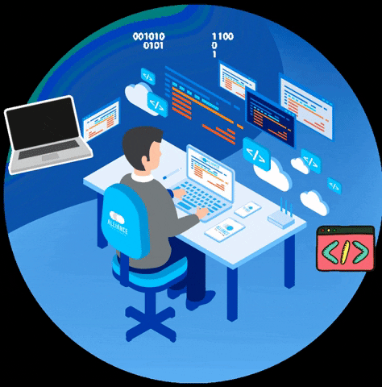

# Hello World! Bem vindo ao meu GitHub! 👽
Estou começando meus estudos no desenvolvimento de sistemas e espero chegar longe! Atualmente trabalho e estudo.

- 📘 Estudante de ADS
- 🖥️ Trabalhando com Suporte de Hardware e Software

  &nbsp;
  &nbsp;
  &nbsp;

---

   
   
   

---

